# Team 305 Appendix

## Team Organization

**Team Goals:**
* Maintain consistent and productive work schedule
* Furthering passion of coding, like working with code repositories (github)
* Further knowledge in manufacturing process
* Advance knowledge in professional PCB design 
* Create a reliable and sturdy final product within the project requirements

**Communication Channels Table:**

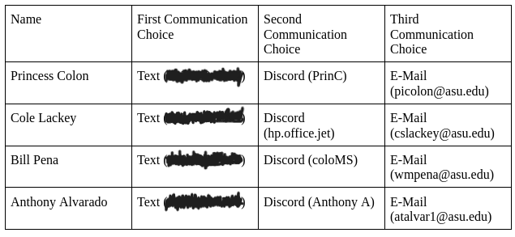

### Communucation Procedures

**How will your team communicate (e.g., group text, email, Canvas, Slack, Discord, telephone)? Consider the need for both asynchronous and synchronous discussion types, and the expectations that come with each mode of communication.**

Our team will be communicating primarily through text messaging. For meetings that require all members to be present, in person meeting is preferable but if all members can not attend, such meeting will be done via Discord.

**How will you handle instructor correspondence? Who is responsible? How will that be communicated with/back to the group?**

Communication to the instructor will be handled via email in which the person will tag the rest of the team in the correspondence. 

### Meeting Schedule

In order for the team to conduct meetings, a text reminder will be sent out on the day of the meeting both a couple of hours prior and immediately before. Meetings will occur on a consistent agreed upon schedule. Assuming a meeting change happens in response to the relative workload required for a 314 assignment, changing meeting times will be discussed in class with a text sent out as a reminder. Under other circumstances, a discussion will be conducted via text in-order to determine a new meeting time. It is preferred that meetings happen face-to-face on the ASU Polytechnic campus though Zoom will be available as needed.

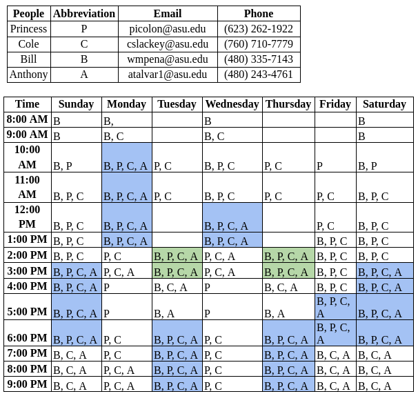

### Roles & Responsibilities 

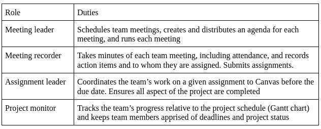

For our team, project roles are to be picked voluntarily, and once assigned, they are to remain in that role unless there is an accommodation that is required that prevents them from satisfying said position. This should be communicated in advance. In such a scenario, a consensus will be reached among the team members for who is best capable to fulfill the role switch or the responsibilities of the role in question can be distributed among the different roles. However, if a role switch is not required but only assistance is, any role is allowed to assist at any time. 

Projects will be kept on track through the use of a Gantt chart via Smartsheet. And the team leader will be responsible for ensuring that all requirements are met among the team members. 

The current roles for the project are as follows:
* Meeting leader - **William Pena**
* Meeting recorder - **Anthony Alvarado**
* Assignment leader - **Princess Colon**
* Project monitor - **Cole Lackey**

**How often will you change project roles?**
* Every 3 weeks

**How will you decide who is assigned to each role?**
* We all picked initially what role we wanted to be and every three weeks we will rotate the roles by 1 downward. (Ex/ Current assignment leader will become the project monitor)

**How will team members help one another meet their responsibilities?**
* Team members can ask other group members for help when needed and every person in the group is expected to be supportive and encouraged. 

**How will you identify and respond to situations where the team must adjust roles and responsibilities?**
* Group discussions either through text, in-person meetings, or Zoom will determine any role changes if needed. 

**How will you track the team activities and milestones?**
* We will create a separate team meeting notes document.

**How will you assign technical responsibilities to team members?**
* Technical responsibilities will be included in the team Gantt chart and distributed among team members based on group discussions and individual strengths. 

### Team Coordination & Accountability

To complete assignments as a team, we will begin with a general meeting about what needs to be done. Outside of hard scheduled meet times, all team members can work on the project at any time. However, the assignment must be completed the day before, including the quality check. The assignment will then be submitted by the Meeting Recorder. To ensure the assignment is completed successfully all members will be required to report on which portion of the assignment they will best be able to assist. However, the final say will go to the Assignment Leader. Making sure everyone on the team is informed of the design review will fall under the task of the Project Monitor. 

For things referring to accountability and team conflict, it will be subject to the Conflict Resolution Protocol.

### Conflict Recognition & Resolution

_The team members agree to the following process for resolving conflicts with other team members:_

1) If, by 48 hours of initial contact by team leader, any member does not reply, they are to be removed from the corresponding assignment 

2) If, after two repeated violations of [1], the violating member is to be considered a missing participant, and to be removed indefinitely via pink slip until contact is reestablished. Assuring this on assignments shall fall under the jurisdiction of the Meeting Recorder

3) If, in the conditions where there is a conflict among members, a meeting will be scheduled at the next available time to resolve said conflict. Planning meetings will be done by the Meeting Leader position and hosted on the platform Zoom

4) Conflicts regarding project course decisions are to be voted anonymously. If consensus is unable to be met during the meet times established by the Project Planner, decision making power shall be deferred to the Team Leader Position

5) For intrapersonal team conflict, Article 3 is invoked at the next possible meeting time disregarding any preset assignments. If there is no resolution to which all parties are satisfied, it is to be referred to the professor or TA of the course for further action. This can be done by any member. 

6) Team decisions related to conflict resolution and student participation are to be made via vote, including the approval of this protocol which shall be done unanimously.

7) Any debate to change this protocol can be started by any present participant.

### Signatures

## User Needs, Benchmarking, and Requirements

### Voices of Customers (VOC) Benchmarking

### Product 1

* **Keywords:** “portable weather station”

* **Product Name:** “sainlogic Wireless Weather Station with Outdoor Sensor, 8-in-1 Weather Station with Weather Forecast, Temperature, Air Pressure, Humidity, Wind Gauge, Rain Gauge, Moon Phase, Alarm Clock (No WiFi)”

* **Product Link:** https://amzn.to/4aOIjw5

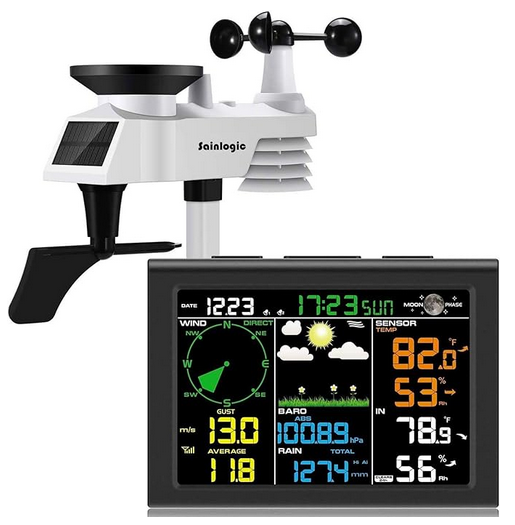

* **Price:** $150.00

* **Vendor:** Amazon

* **Description:** _Easily call up information on temperature, humidity, etc. The reception range of the device has been improved which means the measurements of sainlogic weather station are more accurate. The wireless weather station with rain gauge and wind speed measures indoor/outdoor temperature and humidity, wind speed/direction, air pressure. Experience the convenience of your personal home weather station. Wrap up the best Christmas gifts now!...The 5-in-1 outdoor weather station sensor consists of a rain funnel, solar panel and transmission module, wind vane and high-speed anemometer, and transmits current information about temperature, humidity, air pressure, wind speed and wind direction, as well as the precipitation and much more. Assembly is easy, please follow the instructions provided…_

**Positive Comment 1:**

_“... Installation was easy, and the mounting bracket, arm, and base give you lots of options for horizontal or vertical, on either a flat surface or on a pole. Since we had the last one up high on a pole above the fence, we did the same thing here is it worked out very easily._

_The base unit readout screen is nice, good contrast, lots of information on it, more than we had on the last one. It hasn't rained yet, so we haven't seen how that works yet, but the rest of it has been effective, in comparison to our neighbors and some other readouts we have available nearby. Setting all the options along with date, time, and measurement/unit preferences was quick and easy._

_Getting the station and base unit to link up was simple and easy without any problems following the quick start instructions…”_

**Generated User Needs:**

    Implies the need for a simple installation process

    Implies the need for a clear user interface

    Implies the need for easy to change settings

**Positive Comment 2:**

_“There are a great number of weather stations on the market that provide a varying range of data. Finding one that targets what you need can be daunting if not exhausting by the time you do all the research. I depend on solar panels to power my home and needed a unit that, along with the basic weather data, could provide sun radiation readings to compare to the panel array performance. My aim was to find something easy to operate but still provide key weather data that was reliable, consistent and affordable. After researching the available units I purchased the Sainlogic 089. Keep in mind that any weather station won’t stand a chance of providing accurate data if you don’t follow the instructions. The user manual provided sufficient details (and pictures) to make the installation easy. We were up and running with a connection to an online weather channel within an hour.”_

**Generated User Needs:**

    Implies the need for readily available, reliable and accurate data
    
    Implies the need for simple device operation
    
    Implies the need for simple manual instructions

**Positive Comment 3:**

_“Had it up and running in less than an hour. Only disappointment was no batteries were included. Other than that, I'm absolutely satisfied. Easy to read and accurate.”_

**Generated User Needs:**

    Implies the need for an organized/ readable display
    
    Implies the need for a quick installation process
    
    Implies the need for readily available power source (i.e. batteries)

**Negative Comment 1:**

_“The setup on this product was fairly straightforward. Didn't have any problems there. What I've found is that the outdoor temperature is fairly accurate down to about freezing temperatures. Then it starts to diverge. By the time the temperature is in the teens, it measures 4 degrees warmer than it really is. The reason I know this is that I have two other already proven sensors strapped to the pole of the sainlogic and have observed consistent data supporting this conclusion. Because it doesn't measure 4 degrees difference across all temperatures, I can't add an calibration factor that the device allows. That is a nice feature by the way, but not useful in this case._

_The other big complaint I have is that the anemometer stops working with accumulating snow. Yesterday we only received 2 inches of snow and it prevented it from working. The direction still works because that is not obstructed by accumulating snow, but the gust and average speed does not work until the snow melts. This is a poor mechanical design. I've owned other weather stations in this same home and they do not have this problem.”_

**Generated User Needs:**

    Implies the need for accessibility in extreme cold temperatures
    
    Implies the need for a confidence scale behind data predictions
    
    Implies the need for debug features
    
    Implies the need for power LED indicators

**Negative Comment 2:**

_“This weather station worked for a couple of months, then stopped transmitting the outside temperature, wind speed and rainfall. We changed the batteries, went out and bought expensive lithium batteries and the reset button on the unit stayed red, never green like it’s supposed to be!
It worked long enough for it to no longer be covered by Amazon or its seller. As a matter of fact, it doesn’t even come with a warranty! So I again, urge you not to WASTE your money!”_

**Generated User Needs:**

    Implies the need for a long-lasting power supply
    
    Implies the need for components

**Negative Comment 3:**

_“Will not record rainfall. Tried it in the house and it works but once hung it will not record any rainfall- even a pouring rain. We have it where our old weather station was for years (different company). Tried reaching out for customer support and got no response. Display doesn’t show feels like temp or past rainfall without going through elaborate steps. In the cold north the feels like temp is important. Crap station and would not recommend. Unfortunately past the point of returning so stuck with it. Guess I’m buying a rain gauge.”_

**Generated User Needs:**

    Implies the need for “feels-like”temperatures. 

    Implies the need for knowing the amount of rainfall. 

### Product 2

* **Keywords:** Wireless Color Weather Station

* **Product Name:**  “La Crosse Technology 308-1414MB-INT Wireless Color Weather Station with Mold Indicator, Black”

* **Product Link:** https://www.amazon.com/Crosse-Technology-308-1414MB-INT-Wireless-Indicator/dp/B00NMRZEU4?source=ps-sl-shoppingads-lpcontext&ref_=fplfs&psc=1&smid=ATVPDKIKX0DER

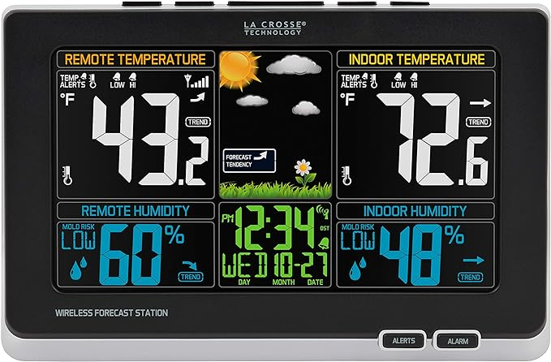

* **Price:**  $65.99

* **Vender:** Amazon

* **Description:** _Precise, real-time backyard weather with wireless technology. Animated weather icons display your personal forecast based on barometric 
pressure. Monitor indoor & outdoor temps & humidity levels and their trends. Set personal alerts for both indoor & remote temperatures. View mold risk either remotely or indoors (basement or crawl space) with wireless sensor. Accurate atomic time and date and indicators for low battery power. Includes AC adapter for display, and batteries are required for backup (not included) and for wireless sensor_

**Positive Comment 1:**

_"I just love these units. I have purchased four to date. One for a gift, one for each of my two houses, and one I left behind in a previously owned house. The base station does work on battery but I plugged mine in for brighter display. I use Cord Mate brand wire covers to hide the power cable. The home base battery kicks in during a power loss. The outside sensor is meant to be protect from direct rain but mine out totally outside in the elements for over two years (Oh Oh, I may have just voided my warrantee). One is in Maine with snow and rain). One in California in blistering heat and rain. Would I buy it again. Yes, I have again and again."_

**Generated User Needs:**

    Implies the need for measuring weather conditions across different settings

    Implies the need for compatibility in rainy conditions

    Implies the need for compatibility in sunny conditions

**Positive Comment 2:**

_"This is a HUGE upgrade from the piece of junk I bought from Walmart a few years ago. The display is bright and the remote sensor worked as soon as I put in the batteries. The one this replaced always had a problem communicating with the sensor and the past few months I was going through batteries like crazy. This one at least has an AC adapter and just that feature alone makes it worth buying it. There are videos on YouTube that show how to set this up too, in case you don't like to read directions._

_Two and half year update: I bought this in April 2017 and if worked flawlessly. I've only had to change the batteries once in that time until recently. Just a few days ago I had to change the batteries again. After jumping through all the hoops to do that to make it work again (take out the batteries from both the station and remote, unplug the station, press any button at least 20 times and leave it unplugged for 15 minutes), which there is no documentation on unless you happen to find this instruction on their youtube channel, my remote only works for a day or two and I have to repeat the process. So it's clear to me I have to buy either a new remote for over $25 of a new station and remote for $65. Yes, two and a half years is a long time but I think this should have lasted a lot longer since there are no moving parts, just electronics. The remote doesn't even look water proof since when I first opened it a few days ago, there was water in it. You'd think they'd make these things water proof, or at least water resistant. But oh, you can buy"_

**Generated User Needs:**

    The customer needs a reliable way to measure weather conditions over time

    Implies the need for a simple installation process
            
    Implies the need for reliable weather measurement methods
    
    Implies the need for long-distance control

**Positive Comment 3:**

_"My old sensor stopped working so I upgraded to this. Works great. Easy to see numbers"_

**Generated User Needs:**

    Implies needs to be able to easily determine environment conditions

**Negative Comment 1:**

_"Very disappointed. The outside sensor only worked for a week or 2 before it died. I had even bought the ridiculously expensive plastic cage that is supposed to shield the sensor from the elements. I don't know if it didn't work or if the sensor was so crappy that no amount of protection was going to keep it alive. I've replaced the batteries with new ones and cannot resuscitate the sensor — it's dead, Jim._

_I bought this weather station because I had another La Crosse weather station (different model) at my previous house and it had worked perfectly for over 5 years. This one barely made it to 5 days. I already have several devices which tell me the indoor temperature and humidity — I bought this for the outside info — exactly what it's not giving me._

_I'm certain I can't return this to Amazon at this point since only the indoor unit hasn't been exposed to the weather. I'm thoroughly disgusted at this point at the money I've wasted on this La Crosse product! Never again!"_

**Generated User Needs:**

    The customer needs a way to remotely monitor the weather conditions outside
    
    Implies the need for a durable design. 

**Negative Comment 2:**

_"Looks good but not very accurate. I have 3 other digital thermometers, I put them all side by side and let them stabilize for an hour. The Lacrosse Indoor temp read 80.8 degrees and all the others read 79.5 exactly ( the other 3 read exactly the same and they were different manufacturers). I even have one that reads Celsius, converting C to F came to 79.5 degrees. The Lacrosse unit reads 1.3 degrees too high. Also the Indoor humidity is off as well, the Lacrosse reads 42%, all of the others read 49%. The Outdoor temp on the LaCrosse read within .1 degree of the other units but the Humidity reading is way off. The other 3 units read between 61% to 63%, the Lacrosse reads 53%. Not very accurate but it looks good..
UPDATE - the power adapter died after 3 days, I'm sending it back to Amazon."_

**Generated User Needs:**

    Implies the need to have access to accurate temperature data. 

    Implies the need to have access to accurate humidity data. 

    Implies the need for a long-lasting power source. 

**Negative Comment 3:**

_"Do not like! It is hard to read unless you are right in front of it. It is so directional, you can not see it at certain angles. Very disappointed. I wanted to set this on a piece of furniture in my bedroom and be able to see it when in bed at night. You have to stand up to be at an angle to actually see the numbers. I would send it back, but threw the box that it came in away and didn't set it up immediately. Dumb on my part thinking it would work. We had another one that worked perfect, but the lights on it have dimmed so much, you can't see it, but it is very old. Don't order, you will be disappointed,"_

**Generated User Needs:**

    Implies the need for easy readability. 

    Implies the need for adjustable viewing angles. 

    Implies the need for long-lasting bright display.

### Product 3

* **Keywords:** “Remote Monitoring Weather Station”

* **Product Name:** “Ambient Weather WS-8482-3107 7-Channel WiFi Remote Monitoring Weather Station with Indoor/Outdoor Temperature & Humidity, Floating Pool, Spa & Pond Thermometer”

* **Product Link:** https://www.amazon.com/Ambient-Weather-WS-8482-3107-Temperature-Thermometer/dp/B07MGJ4F4T?source=ps-sl-shoppingads-lpcontext&ref_=fplfs&psc=1&smid=A2ANVX7C75D1I

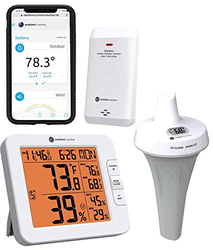

* **Price:** $146.50

* **Vendor:** Amazon

* **Description:** _The Ambient Weather WS-8482 monitors indoor and outdoor conditions including indoor and outdoor temperature and humidity, heat index, and dew point. The console measures locally, and up to 7 sensors can connect for remote monitoring. Channels 1-7 for the remote sensors display with an auto-scroll feature. The console supports both imperial and metric units of measure and displays min/max data, allowing you to set up independent alerts for all parameters. The time and date automatically synchronize to the Internet NIST time server_

**Positive Comment 1**

_"I have several wireless thermometers. My main complaint with them is the lack of accuracy. I did some research and found the product line from Ambient Weather. I bought this one because it came with the wireless temperature sensor for the pool, as well as a thermometer/hygrometer outdoor sensor._

_I read the other reviews on Amazon and saw that many people expressed extreme frustration with the setup of the device. I experienced none of those frustrations. I have quite a bit of experience setting up similar devices such as WiFi-connected garage door openers, doorbells, cameras, and other weather gateways. That experience helped for sure. I also work in information technology and so my technical skills are probably higher than the average person._

_Regardless of technical skill level, the setup of this device is actually very straightforward as long as you follow the instructions carefully._

_The key to setting up this device is connecting your computer to the device's internal WiFi access point. That is how you connect your computer (or smart phone) to the device during initial setup. Then you put in the information for your own WiFi so the device can then connect to your network and from there, to the internet._

_You don't have to set up the wunderground.com and ambientweather.net if you don't want to. But it's easy and kind of fun. So record the MAC address that is shown when you connect to the configuration page of the device, or just look on the back for the sticker that has a number such as "00:AB:12:34:CD:EF" and then head over and register an account and your device there. Then fill out the appropriate fields on the device while you're setting it up._

_It did take me two tries to get my device connected to my home WiFi. But the entire setup process probably took about 30 minutes._

_I did run into a little trouble with the sensors. One of them kept coming up as "Er" in the display. I ended up removing the batteries, changing the channel, and reinserting the batteries. (If you change the channel, you have to remove and reinsert the batteries in order to get it to actually change the channel.) After a bit of minor fiddling, the device was able to receive data from both of the sensors and also send data to the two websites. I installed the Ambient Weather app, signed in with my account and now I see the data displayed on my phone as well._

_I've only had this device up and running since last night, but it's dialed-in and working perfectly._

_Don't let the negative reviews deter you if you have some technical wherewithal and the ability to follow instructions carefully. You will likely have no serious problems._

_A word of caution regarding the water-resistant pool temperature probe: Make sure that the o-ring is carefully pressed into the groove in the top part of the casing. It would be a good idea to use some silicone grease as well. The o-ring may pop out of the groove when you open the case to insert the batteries or change the radio channel. Be very careful to ensure that you replace it properly or your device could fill with water and cause damage."_

**Generated User Needs**

    Implies the need for accurate temperature readings

    Implies the need for simple setup instructions

**Positive Comment 2**

_"We have one of the thermometers in the pool which is a good 200 feet from our house. The other sensor is in our bedroom. They both communicate with the home station with NO issues. It's really nice to be able to know the temperature of the pool before heading out!
This is the 2nd time we bought this. The first time I put the pool sensor in my hot tub once pool season was over. I'm not sure if they warn against this or not. But it didn't last long in the 105 degree hot tub. I'm guessing it has more to do with the humidity with the cover on...but don't make the same mistake I did. Highly recommend."_

**Generated User Needs**

    Implies the need for communication across devices

**Positive Comment 3**

_"Last winter I vacationed in Florida the month of January. When I returned to Wisconsin my hot tub was nearly frozen over. Luckily I was able to get a technician out to replace a circulating pump before any damage was done to the piping._

_Before going to Florida this year I searched for a wi-fi enabled thermometer that I could access while in Florida. I found very little information on available systems. Comments on the Ambient Weather System did not give me comfort that the signal would penetrate the 5in. cover so I decided to wing it. A week before we were to leave I made a last minute decision to purchase this system and see how it worked. When I set it up, the signal was received by the receiver and I could monitor temperature via the internet._

_The first week in Florida I logged on and saw the temperature was dropping. I had a neighbor go check on the hot tub and the breaker was tripped and would not reset. The technician came out and replaced a defective heater. A week later the same situation occurred and again I called the technician. Turns out he had jostled the hot tub plug and the water level dropped shutting off the hot tub._

_Without this product I would have had thousands of dollars in damages and probably would have had to replace the tub. I'm back in Wisconsin in February and everything is a little better when you have a hot tub."_

**Generated User Needs**

    Implies the need for clear data presentation through a phone app

    Implies the need for customized warning/ limit indicators

**Negative Comment 1**

_"One of the most ridiculously complicated solutions to what should be a basic function . Just wanted an easy to use weather monitor and pool temp monitor. I work in tech and after an hour of trying to get it set up and get the sensor to synchronize it’s all I could do to return it and not throw it across room. Also, no way am I creating a potential security issue with my WiFi by having this product synchronize externally. Perhaps if one fancies themselves an amateur meteorologist this is useful but for those of us that just want basic information in an easy by use package, this ain’t it."_

**Generated User Needs**

    Customer needs to monitor temperature of their pool

    Implies the need for wifi connectivity
    
    Implies the need to monitor water temperature

**Negative Comment 2**

_"I bought it for the API, so that I could automate things based on the temperature. The API is incredibly inconsistent, with a history of days-long outages. I eventually had some luck using the "unofficial" API used by their web UI, which seems to be separate and more reliable. That only works if you set your weather station public, which is obnoxious because I didn't want to do that._

_Eventually, the outside thermometer stopped working. I've been using the pool thermometer as an outside thermometer. That worked for awhile, but the base station loses it more and more often lately, and I've finally given up._

_I ultimately just bit the bullet and bought an ESP8266, put micropython on it, and hooked up a set of temperature sensors off Amazon. I had really wanted to avoid rolling my own, hence buying this item. Turns out, it was super easy to wire up my own sensor and hook it up to a free grafana account. Way more reliable and a fraction the cost, and I have a pool and outside sensor. No humidity but I can add a sensor for that if I want to. Now this item is going in the trash."_

**Generated User Needs**

    The customer needs a device that can measure temperature for at least 7 years
    
    Implies the need for knowing air pollution levels
    
    Implies the need for a private API solution

**Negative Comment 3**

_"I tried to get help from support, they were annoying and unhelpful. I bought my first of these about 2 years ago. It worked till the batteries died, when I replaced the batteries it immediately died. My bad, I thought. Got a new floaty sensor thing, same story.... worked till batteries died, was super careful to follow instructions with replacing the batteries, used the right lube, dies within a couple days of putting it back in the water. I tried a 3rd time! I really like it, I really wanted it to work. This time the batteries didn't even die. I live close to their office, thinking about returning their trash in person._

_Tldr wonderful device, except it only last ~6 months."_

**Generated User Needs**

    The custom needs good customer service
    
    The customer needs lubricant
    
    Implies the need for quality customer service
    
    Implies the need for a consistent power source

### Product 4

* **Keywords:** “Weather Station”

* **Product Name:** “RainWise MK-III RTN-LR Weather Station”

* **Product Link:** https://www.weathershack.com/product/rainwise-mkiiirti-lr.html

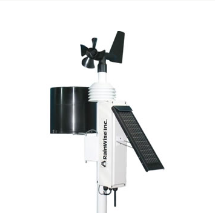

* **Price:** $895.95

* **Vendor:** Weather Shack

* **Description:** The RainWise MKIIIRTI-LR sensor array combines all outside sensor components into a single compact unit that's easy to install. With a transmission range of over one mile line of sight, this sensor array is a great choice for applications where remote conditions must be monitored from a long distance.

**Positive Comment 1**

_"Upon opening the box, I found the unit to be packed well and the station appears to be well built. It's set up is extremely simple as all that's needed to do is mount the station in an appropriate location using either the mono mount or tripod mount, set the solar panel accordingly, orient to true south, then switch the unit on."_

**Generated User Needs**

    Implies a need for a portable weather solution
    
    Implies the need for easy installation
    
    Implies the need to monitor weather in remote locations
    
    Implies the need for a low/zero maintenance 

**Positive Comment 2**

_"The overall design of the MKIIIRTI-LR is nice but for this price and with the large solar panel and good sized battery, it really should at least, have a fan aspirated temperature sensor to reduce sun induced temperature variations especially in low wind situations. Also, why not already have solar, UV or both sensors already attached. Most much cheaper stations now have these sensors as part of the whole package. I'm hoping the new station performs better than my older station which has not fared well in the harsh Wyoming climate it's constantly exposed to. Time will tell..."_

**Generated User Needs**

    Implies the need for a off the grid solution
    
    Implies the need to measure fan aspirated 
    
    Implies the need to measure UV light
    
    Implies the need to measure weather conditions in harsh environments

    Implies the need for a fan aspirated temperature sensor 

**Positive Comment 3**

_"This unit replaced MKIII I purchased several years ago. The electronics degraded on my original MKIII to the extent the unit no longer functioned. In addition to the MKIII I purchased I had to get a new display panel (long range version). I recommend that Rainwise institute a refurbishment program rather than forcing customers to completely replace the unit and display panel."_

**Generated User Needs**

    Implies need for long term use
    
    Implies need for weather monitoring over long ranges
    
    Implies need for portability

**Drawbacks:**

* Needs a supporting display bought separately to work

* Implies need for an all-in-one solution
    * Needs supporting display to be from the same generation as the weather station
    * Implies need for intercompatibility with multi-generational support equipment

### Product 5

* **Keywords:** “deployable weather station”

* **Product Name:** La Crosse Technology V21-WTH Wireless Wi-Fi Weather Station

* **Product Link:** https://amzn.to/3O9WORh

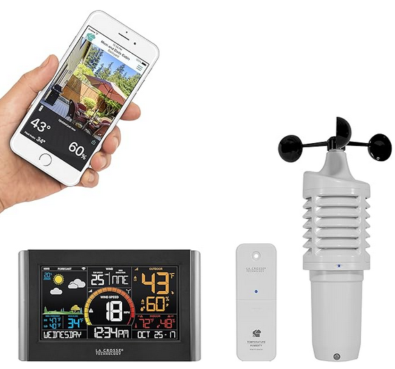

* **Price:** $133.95

* **Vendor:** Amazon

* **Description:** _Introducing La Crosse Technology’s new Remote Monitoring Professional Weather Station system that offers a combination of quality engineering, design, and functionality. The innovative system’s display receives and transmits data wirelessly for optimal accuracy with built in Wi-Fi by connecting to multiple sensors and has enhanced features when connected to the La Crosse View App. Sensors in this system include a wind speed sensor, a rain sensor, and a temperature and humidity sensor, bringing you your backyard weather anytime, anywhere. The display acts as command center for all elements of the system, featuring a large LCD panel with brightly colored numbers and graphics and an adjustable kickstand, making the display easy-to-read from any angle in the room. The intuitive button design, located at the top of the station, allows you to effortlessly navigate through the display for adjustable screen brightness, easy setup, sensor data, and setting alerts. The built in Wi-Fi module is programmed to send all sensor and display information directly to our servers, which is maintained by our team of skilled technicians, quickly processed and sent to you and your network of friends via the La Crosse View App_

**Positive Comment 1**

_“Bought the La Crosse Technology V21-WTH unit about 3 weeks ago and it is working perfectly so far. Had some crazy weather for this area and all the functions reported properly. The accuracy of temp and humidity appears to be consistent. As compared to a separate wireless thermometer the readings pair consistently. Setup was a bit tricky getting the weather station to pair with my iPhone. Had to go to their web site for problem solving. Quickly found the fix and all good from there. The display has several brightness settings from off to high and clarity/readability are good. The anemometer is mounted @ 50 feet straight line of site from the base unit atop the rear fence. The temp/humidity sensor about 25 feet away protected by the patio cover. No signal issues as these sensors have much further range especially if unobstructed. Will take time to figure out how long the 2 size C batteries for the anemometer last before needing replacement. I've seen a post that suggests it's in the 3 month range but that was in some sub-zero weather.”_

**Generated User Needs**

    Implies the need for easy pairing for phone applications
    
    Implies the need for long-range operation
    
    Implies the need for common/ easy to use power source

**Positive Comment 2**

_“I like having separate devices for my weather system. The display is very bright and seems to respond quickly to the changes. The wind meter is perfect! I don't have it connected to the internet. I just wanted local information.
The display is working beautifully, it seems to be very accurate. I have several other remote sensors and it hears those as well so I see consistent info.
I didn't want to spend $300+ for a weather station. So my choice has worked out well. This has just the right amount of information without breaking the bank.”_

**Generated User Needs**

    Implies the need for responsiveness
    
    Implies the need for affordability

**Positive Comment 3**

_“This is very accurate, I am impressed with the color screen and all the information it provides, it is a little smaller the the older version I have which still works like new. The old unit was not color and thought I would like this, I was not disappointed.”_

**Generated User Needs**

    Implies the need for a colorful display

**Negative Comment 1**

_“when I first bought the thing, I had trouble with the wind and temp stations. somehow I managed to connect both and the wifi. HOWEVER, after a month, it lost connect to everything, including wifi. I have tried 30 times to get it to connect. the station will not go into wifi mode it seems even after a factory reset. also, the instructions tell you that the wifi signal is near the clock. its NOT. furthermore, the wind sensor and temp sensor both show that they are connected with full strength. but they are NOT connected at all. remove the battery and the connection sensor is still on 10 min later…”_

**Generated User Needs**

    Implies the need for a simple reset button.

    Implies the need for visual instruction. 

    Implies the need for phone use over wifi.

    Implies the need for computer use over wifi.

**Negative Comment 2**

_“I've owned numerous La Crosse devices and have owned the V21-WTH for about a year. Unfortunately, I moved to a new house and can not get the device to connect to the new WIFI network. I've read the FAQ documents, watched their videos where they explain what hoops you have to jump through, I've reconfigured my network to match their limitations, and tried to contact their support desk with no response. After about four hours, I'm giving up. Next step is to toss it and buy something from another company…”_

**Generated User Needs**

    Implies the need for simple wifi connection process

**Negative Comment 3**

_“The unit would connect to my 2.4Ghz for about 10 minutes then the WiFi would drop. Reconnected multiple times over a few days with the same results. Also, as soon as it connected, the time jumped 21 hours forward, thus the forecast was for a totally different time zone. I contacted tech support, and received a call the following day. The timezone issue was a "known issue", their engineers were "working on it", but there was no ETA. Connecting to an NTP server is not rocket science. I waited a few more days and it still wasn't working so I returned the unit…”_

**Generated User Needs**

    Implies the need for accurate time zone representation

### Initial list of User Needs:
1. User needs to measure temperature in the plains
2. User needs to measure temperature in the arctic
3. User needs to measure temperature in the desert
4. User needs to measure temperature on the coast
5. User needs to measure temperature in the forest
6. User needs to measure temperature in mountains
7. User needs to measure fan aspirated temperature in the plains
8. User needs to measure fan aspirated temperature in the arctic
9. User needs to measure fan aspirated temperature in the desert
10. User needs to measure fan aspirated temperature on the coast
11. User needs to measure fan aspirated temperature in the forest
12. User needs to measure fan aspirated temperature in mountains
13. User needs to measure rainfall in the plains
14. User needs to measure rainfall in the arctic
15. User needs to measure rainfall in the desert
16. User needs to measure rainfall on the coast
17. User needs to measure rainfall in the forest
18. User needs to measure rainfall in mountains
19. User needs to measure sunlight in the plains
20. User needs to measure sunlight in the arctic
21. User needs to measure sunlight in the desert
22. User needs to measure sunlight on the coast
23. User needs to measure sunlight in the forest
24. User needs to measure sunlight in mountains
25. User needs to measure UV levels in the plains
26. User needs to measure UV levels in the arctic
27. User needs to measure UV levels in the desert
28. User needs to measure UV levels on the coast
29. User needs to measure UV levels in the forest
30. User needs to measure UV levels in mountains
31. User needs to measure humidity in the plains
32. User needs to measure humidity in the arctic
33. User needs to measure humidity in the desert
34. User needs to measure humidity on the coast
35. User needs to measure humidity in the forest
36. User needs to measure humidity in mountains
37. User needs to measure air pollution levels in the plains
38. User needs to measure air pollution levels in the arctic
39. User needs to measure air pollution levels in the desert
40. User needs to measure air pollution levels on the coast
41. User needs to measure air pollution levels in the forest
42. User needs to measure air pollution levels in mountains
43. User needs to remotely monitor weather conditions in the plains
44. User needs to remotely monitor weather conditions in the arctic
45. User needs to remotely monitor weather conditions in the desert
46. User needs to remotely monitor weather conditions on the coast
47. User needs to remotely monitor weather conditions in the forest
48. User needs to remotely monitor weather conditions in the mountains
49. User needs to measure heat waves
50. User needs to measure weather data during floods
51. User needs to measure drought conditions
52. User needs to measure weather data during hurricane
53. User needs to measure weather data during rain storm
54. User needs to measure weather data during tornado
55. User needs to measure weather data during blizzard 
56. User needs to measure weather data during avalanche 
57. User needs lubricant for batteries 
58. User needs to be able to see temperature from a central location (laptop, phone, etc.)
59. User needs to be able to see rainfall from a central location (laptop, phone, etc.)
60. User needs to be able to see sunlight from a central location (laptop, phone, etc.)
61. User needs to be able to see UV levels from a central location (laptop, phone, etc.)
62. User needs to be able to see humidity from a central location (laptop, phone, etc.)
63. User needs to monitor temperature in multiple locations
64. User needs to monitor fan aspirated temperature in multiple locations
65. User needs to monitor rainfall in multiple locations
66. User needs to monitor sunlight in multiple locations
67. User needs to monitor UV levels in multiple locations
68. User needs to monitor humidity in multiple locations
69. User needs to monitor air pollution in multiple locations
70. User needs to log temperature data
71. User needs to log air aspirated temperature data
72. User needs to log rainfall data
73. User needs to log sunlight data
74. User needs to log UV level data
75. User needs to log humidity data 
76. User needs to log air pollution data
77. User needs to compare years of temperature data
78. User needs to compare years of air aspirated temperature data
79. User needs to compare years of rainfall data
80. User needs to compare years of sunlight data
81. User needs to compare years of UV level data
82. User needs to compare years of humidity data
83. User needs to compare years of air pollution data
84. User needs to know the time
85. User needs to know the day
86. User needs to know the month
87. User needs to know the year
88. User needs to know the century
89. User needs to know the millennium 
90. User needs to know the lunar phase
91. User needs to know where they are located
92. User needs to know the local geography 
93. User needs to know local temperature predictions
94. User needs to know local air aspirated temperature predictions
95. User needs to know local rainfall predictions
96. User needs to know local sunlight predictions
97. User needs to know local UV level predictions
98. User needs to know local humidity predictions
99. User needs to know local air pollution predictions
100. User needs to measure temperature in Celsius and Fahrenheit
101. User needs to measure air aspirated temperature in celsius and fahrenheit 
102. User needs a private API solution to remote monitoring weather conditions
103. User needs a secure API solution to remote monitoring weather conditions
104. User needs to measure adverse weather conditions safely
105. User needs to know when a forest fire starts
106. User needs to know where forest fires are

### User Needs on Jamboard

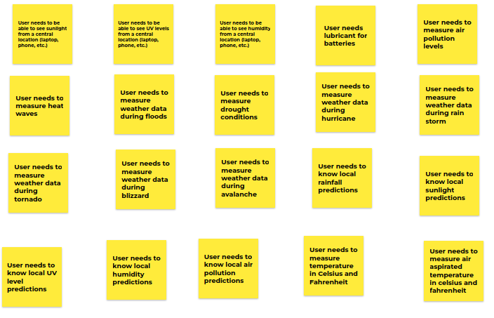

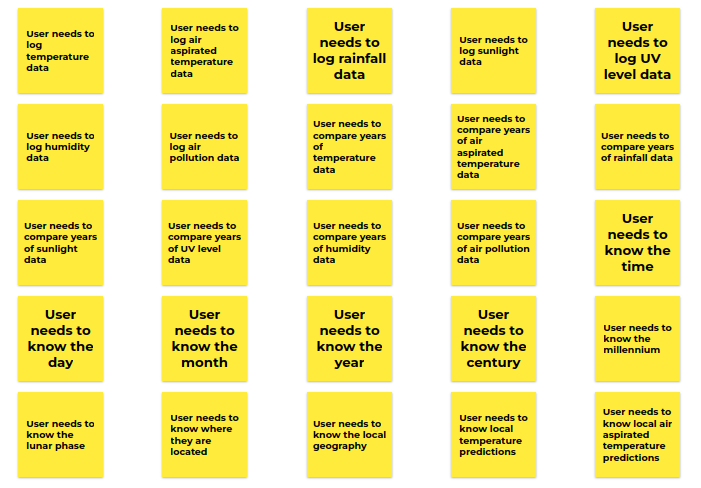

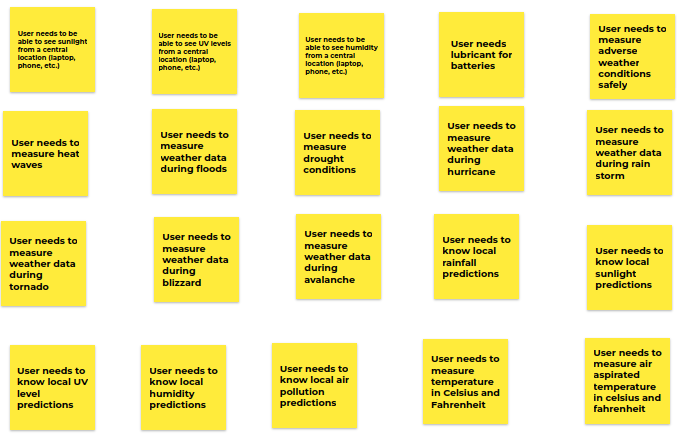

missing photo of OG jam board :(
    
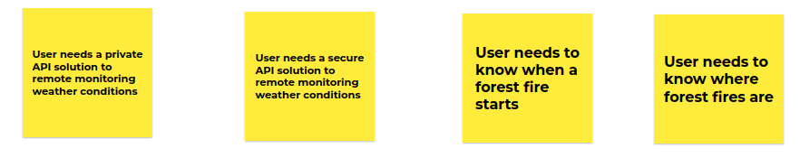

### Grouped User Needs on Jamboard

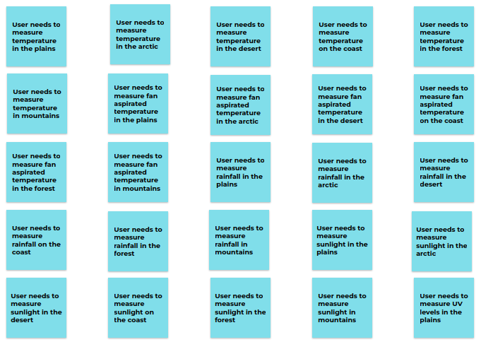
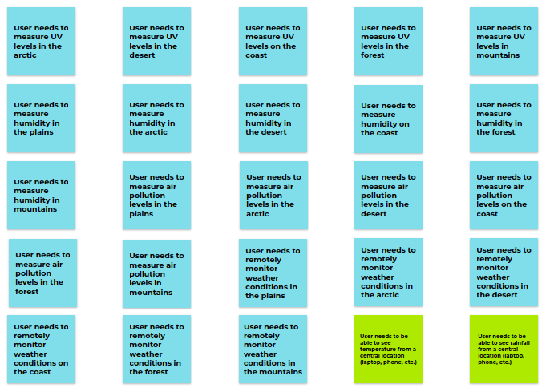
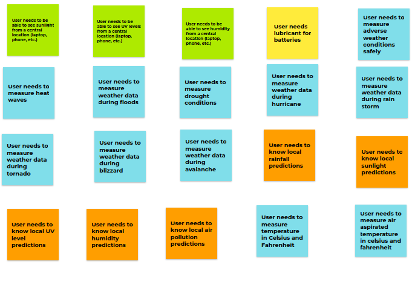
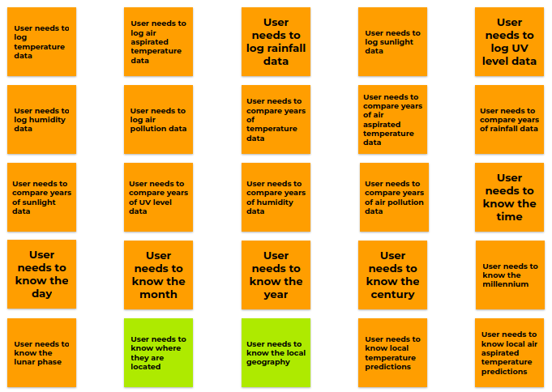
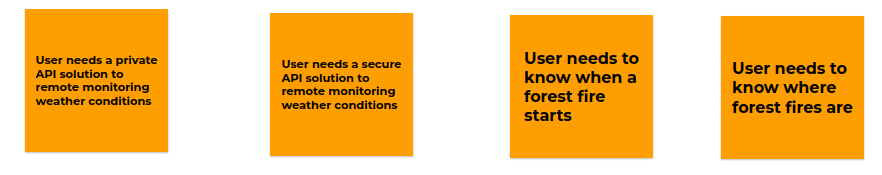

### Grouped and Ranked User Needs:

**Weather Condition Measurements:**
* User needs to measure temperature in the plains ⭐⭐⭐
* User needs to measure temperature in the arctic ⭐⭐⭐
* User needs to measure temperature in the desert ⭐⭐⭐
* User needs to measure temperature on the coast ⭐⭐⭐
* User needs to measure temperature in the forest ⭐⭐⭐
* User needs to measure temperature in mountains ⭐⭐⭐
* User needs to measure fan aspirated temperature in the plains ⭐⭐
* User needs to measure fan aspirated temperature in the arctic ⭐⭐
* User needs to measure fan aspirated temperature in the desert ⭐⭐
* User needs to measure fan aspirated temperature on the coast ⭐⭐
* User needs to measure fan aspirated temperature in the forest ⭐⭐
* User needs to measure fan aspirated temperature in mountains ⭐⭐
* User needs to measure rainfall in the plains ⭐⭐
* User needs to measure rainfall in the arctic ⭐⭐
* User needs to measure rainfall in the desert ⭐⭐
* User needs to measure sunlight in the desert ⭐⭐
* User needs to measure sunlight on the coast ⭐⭐
* User needs to measure sunlight in the forest ⭐⭐
* User needs to measure sunlight in mountains ⭐⭐
* User needs to measure UV levels in the plains ⭐⭐
* User needs to measure UV levels in the arctic ⭐⭐
* User needs to measure UV levels in the desert ⭐⭐
* User needs to measure UV levels on the coast ⭐⭐
* User needs to measure UV levels in the forest ⭐⭐
* User needs to measure UV levels in mountains ⭐⭐
* User needs to measure humidity in the plains ⭐⭐⭐
* User needs to measure humidity in the arctic ⭐⭐⭐
* User needs to measure humidity in the desert ⭐⭐⭐
* User needs to measure humidity on the coast ⭐⭐⭐
* User needs to measure humidity in the forest ⭐⭐⭐
* User needs to measure humidity in mountains ⭐⭐⭐
* User needs to measure air pollution levels in the plains ⭐
* User needs to measure air pollution levels in the arctic ⭐
* User needs to measure air pollution levels in the desert ⭐
* User needs to measure air pollution levels on the coast ⭐
* User needs to measure air pollution levels in the forest ⭐
* User needs to measure air pollution levels in mountains ⭐
* User needs to remotely monitor weather conditions in the plains ⭐⭐⭐
* User needs to remotely monitor weather conditions in the arctic ⭐⭐⭐
* User needs to remotely monitor weather conditions in the desert ⭐⭐⭐
* User needs to remotely monitor weather conditions on the coast ⭐⭐⭐
* User needs to remotely monitor weather conditions in the forest ⭐⭐⭐
* User needs to remotely monitor weather conditions in the mountains ⭐⭐⭐
* User needs to measure adverse weather conditions safely ⭐⭐⭐
* User needs to measure heat waves ⭐⭐
* User needs to measure weather data during floods ⭐⭐
* User needs to measure drought conditions ⭐⭐
* User needs to measure weather data during hurricane ⭐⭐
* User needs to measure weather data during rain storm ⭐⭐
* User needs to measure weather data during tornado ⭐⭐
* User needs to measure weather data during blizzard ⭐⭐
* User needs to measure weather data during avalanche ⭐⭐
* User needs to measure temperature in Celsius and Fahrenheit ⭐
* User needs to measure air aspirated temperature in Celsius and Fahrenheit ⭐
* User needs to know when a forest fire starts ⭐⭐

**Data:**
* User needs to log temperature data ⭐⭐
* User needs to log air aspirated temperature data ⭐⭐
* User needs to log rainfall data ⭐⭐
* User needs to log sunlight data ⭐⭐
* User needs to log UV level data ⭐⭐
* User needs to log humidity data ⭐⭐
* User needs to log air pollution data ⭐⭐
* User needs to compare years of temperature data ⭐
* User needs to compare years of air aspirated temperature data ⭐
* User needs to compare years of rainfall data ⭐
* User needs to compare years of sunlight data ⭐
* User needs to compare years of UV level data ⭐
* User needs to compare years of humidity data ⭐
* User needs to compare years of air pollution data ⭐
* User needs to know the time ⭐⭐⭐
* User needs to know the day ⭐⭐⭐
* User needs to know the month ⭐⭐⭐
* User needs to know the year ⭐
* User needs to know the century ⭐
* User needs to know the millennium ⭐
* User needs to know the lunar phase ⭐
* User needs to measure air aspirated temperature in celsius and fahrenheit ⭐
* User needs a private API solution to remote monitoring weather conditions ⭐⭐
* User needs a secure API solution to remote monitoring weather conditions ⭐⭐
* User needs to know local temperature predictions ⭐
* User needs to know local air aspirated temperature predictions ⭐
* User needs to know local rainfall predictions ⭐
* User needs to know local sunlight predictions ⭐
* User needs to know local UV level predictions ⭐
* User needs to know local humidity predictions ⭐
* User needs to know local air pollution predictions ⭐

**Location:**
* User needs to be able to see temperature from a central location (laptop, phone, etc.) ⭐⭐
* User needs to be able to see rainfall from a central location (laptop, phone, etc.) ⭐⭐
* User needs to be able to see sunlight from a central location (laptop, phone, etc.) ⭐⭐
* User needs to be able to see UV levels from a central location (laptop, phone, etc.) ⭐⭐
* User needs to be able to see humidity from a central location (laptop, phone, etc.) ⭐⭐
* User needs to know where they are located ⭐⭐⭐
* User needs to know the local geography ⭐
* User needs to know where forest fires are ⭐⭐

**General User Needs:**
* User needs lubricant for batteries ⭐

