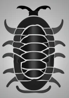
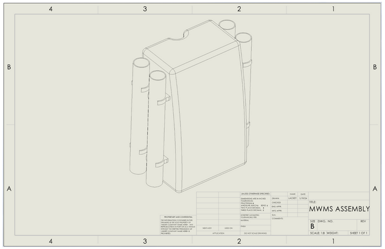
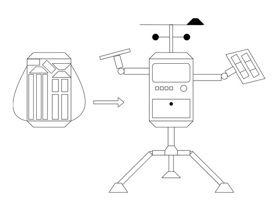
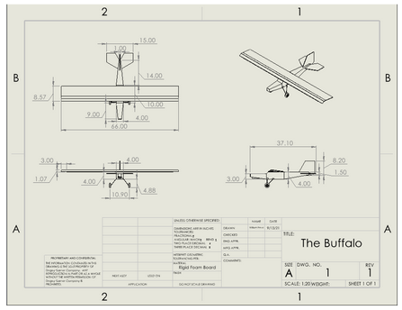

---
# MWMS (Mobile Weather Monitoring Solutions)
---
## Team 305
Anthony Alvarado, Princess Colon, Cole Lackey, William Pena 
---

Arizona State University, EGR 314 (Class #17878), Professor: Kevin Nichols

# Home

## Introduction

**EGR314 - Embedded Systems Design Project II - Team 305**

Welcome to our team's Embedded System Design page. Our team was tasked with developing a mobile weather station that would be capable of measuring at least two different environmental variables, such as temperature, rainfall, humidity, atmospheric pressure, as well as utilize an actuator as per our project guidelines. With these guidelines in mind, we are currently developing a transportable weather station that one could comfortably wear as a backpack so that they could assemble it in an unmonitored location of their choosing. Below, we go more in-depth in our processes. If you wish to find more information, please refer to our appendix page linked below. Thank you for visiting our website. 

**Introducing _The Isopod_**

_Logo generated at www.craiyon.com_

### Checkpoint 1 Presentation

[Link to checkpoint 1 video](https://youtu.be/IFEdKx9uXrw)

## Team Orgainzation

**Team Charter**: Our mission as MWMS is to create a dynamic and collaborative environment where we maintain a consistent and productive work schedule, cultivate a passion for coding and collaboration using code repositories like GitHub, deepen our understanding of manufacturing processes, advance our knowledge in professional PCB design, and collectively deliver reliable and sturdy final products that exceed project requirements.

**Our Mission Statement**: Our team’s goal is to create a flexible solution to remote weather data monitoring and logging for people in rural communities and territories.

## User Needs, Benchmarking, and Requirments

**Project Description**: "This semester we will be producing systems that can respond to the environment using serial sensing and actuation in your system for a mobile weather station. Each team will also broadcast their environmental data to the internet over WiFi using the MQTT protocol."

### User Needs

**Steps Involved in our User Needs Process:**
1. List more user needs based from web forums on industrial products
2. Group similar user needs into categories: 
    1. Data based
    2. Location based
    3. General
3. Ranked User Needs

**Unexpected User Needs:** 
1. Battery lubricant
2. Fan aspirated temperature sensor

### Product Requirements

**Steps Involved in our Product Requirements:**

* Identify Stakeholders
    * Park Rangers/ National Park Associations
    * Camping/ Hiking Clubs
    * Petroleum Companies
    * Farmers
* Brainstormed possible Use Cases based on identified stakeholders
* Brainstormed Product Requirements based on User Needs
    * The product must require no prior training to deploy
    * Display “Feels Like” Temperatures
    * The device must be transportable by an average human

## Design Ideation

**Key Design Concepts:** 
* Solar panel
* Temperature Sensor
* Humidity Sensor
* Removable Padded Backpack
* “Camalback” - sized body
* Poles for Mounting Body
* Sensor API Modules

### Prototype Design #1: Backpack design 

### Prototype Design #2: Backpack to Weather Station

### Prototype Design #3: The Buffalo

# Appendix

[link to Appendix](/appendix)

# Other stuff

## Research Question

* Bullet Point 1
* Bullet Point 2
* Bullet Point 3

## Background

[link to background](/background)

## Results

1. Numbered Point 1
1. Numbered Point 2
1. Numbered Point 3

## Conclusions and Future Work

## External Links

[example link to idealab](https://idealab.asu.edu)

## References
